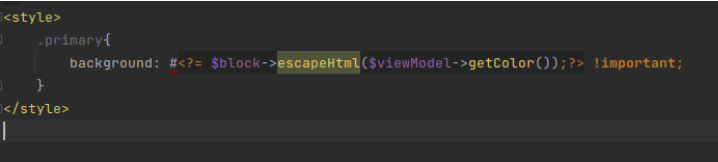

# Desafio Híbrido

## Objetivo

### Alterar a cor dos botões de uma determinada Store através de uma command line interface.

## Parte 1

Para iniciar a tarefa, dentro do painel administrativo foi criado uma multiple store para iniciar o projeto, seguindo os parâmetros indicados pela documentação oficial, realizando a criação dentro do painel e posteriormente, configurando o servidor Apache2;

https://devdocs.magento.com/guides/v2.4/config-guide/multi-site/ms_apache.html

Com o ambiente setado o primeiro passo foi a identificação da classe css responsável pela cor do botão; (.primary)

Dentro do painel de admin, Content->Design->Configuration, podemos realizar padronizações no HTML Head e no Footer, desta maneira, no campo de Scripts and Stylesheets realizei o teste de adicionar o código de estilização com o intuito de verificar se o botão seria estilizado.

O que resultou na alteração da cor do botão.

A partir daí criei o Módulo Barcellos_Color, com a estrutura básica do registration.php e etc/module.xml.

Tendo o esqueleto inicial finalizado, foi necessário encontrar qual era o módulo/container responsável pelo head HTML.

fonte: 
https://magento.stackexchange.com/questions/175970/adding-referenceblock-name-head-additional-magento-2-not-working

Através da informação que o bloco head.additional era o responsável pelo head, usei como referencia o arquivo default_head_blocks.xml do modulo-theme para configurar o do meu módulo;

Criei o arquivo templates/color.phtml, o qual criei uma função que retornasse uma cor de maneira estática para testar o funcionamento, o qual também funcionou.

O próximo passo foi a criação da ViewModel ChangeButtonColor, na qual tambem de maneira estática criei uma função getColor(){ return orange;}, que retornava um valor de cor em string e passando o valor via template strings para o template;

Após funcionar esse passo, a estrutura de transposição de valores estava pronta, só necessitando que o valor recebido na ViewModel fosse dinâmico, para que funcionasse corretamente de acordo com o desafio.

## Parte 2

Agora era necessário criar o CLI;
Utilizei as seguintes fontes:
https://devdocs.magento.com/guides/v2.4/extension-dev-guide/cli-cmds/cli-howto.html
https://www.magespecialist.it/blog/2016/04/22/magento-2-adding-commands-to-magento-cli/

Criando o arquivo Console/Command/ButtonColor.php;

Ele contém 4 funções, cada uma herdando uma classe específica para que a funcionalidade do programa fosse adequada.

Primeiramente foi necessário criar o comando para o botão dentro do configure, seguindo os parâmetros da documentação e adicionando à função execute() um output de confirmação.

Sendo assim, criado o comando bin/magento button-color:change;

Para criar uma condição de que um valor de cor é válido existe a possibilidade do REGEX, mas também uma funcionalidade do PHP;

if(ctype_xdigit($color) && strlen($color)==6)

fonte: https://stackoverflow.com/questions/12837942/regex-for-matching-css-hex-colors

Agora era necessário que os dados passados via comando de alguma maneira pudessem ser acessados.

Para isso utilizei a fonte:
https://firebearstudio.com/blog/how-to-write-and-get-config-values-by-scope-in-magento-2.html

- A qual indica que a interface WriterInterface possui a função de save();
- E a interface StoreManagerInterface possui a função de getStore();

Adicionamos as duas interfaces ao nosso ButtonColor visto que eles serão os responsáveis na nossa tarefa para 1 - configurar o path, variável de cor, escopo de projeto e ID do projeto e 2 - verificar o ID;

Acessando o banco de dados criado para o projeto e verificando a tabela core_config_data, podemos verificar os valores nelas que estão armazenados.

Com a referência do https://www.rakeshjesadiya.com/verify-website-code-valid-magento-2/;
Podemos também averiguar que a getStore recebe uma storeId e já irá exibir um erro de store não existe caso o ID não seja encontrado, portanto podemos utilizar a referência acima como validação utilizando o try and catch para criarmos nossa própria função.

Com a validação de cor e validação de Store o programa está rodando de acordo, para as distintas stores;

Os dados de configuração estão salvos distintamente no banco de dados

Para finalizar a implementação da funcionalidade, automatizar a limpeza de cache após as validações;

Utilzando da fonte: https://www.mageplaza.com/devdocs/clear-cache-programmically-magento-2.html

Foi implementado o TypeListInterface e o Pool, para a criação da função flushCache(), a qual automatiza a limpeza de cache ao ser chamada.

Finalizando a função execute(), que irá assim desta forma, caso passe das validações de cor e store Id, salvar no banco os valores para serem utilizados e enviados para ViewModel e executar a limpeza de cache;

Para finalizar a implantação é necessário atualizar na ViewModel.

Na mesma referência: https://firebearstudio.com/blog/how-to-write-and-get-config-values-by-scope-in-magento-2.html, a qual usamos para escrever e salvar as informações no banco, existe a metodologia para pegar e ler esses dados através da Interface ScopeConfigInterface que possui a função getValue que recebe os parametros de path e scope;
Apenas é preciso alterar o return utilizando este método e assim finalizamos a implementação da funcionalidade

Portanto o comando receberá a cor (Que precisa ser de 6 digitos, sem #) e o Id da store que será implementada a mudança.

Caso o valor da cor não seja compativel com HEX teremos o seguinte erro:

Caso o valor da cor seja correto e a loja inexiste, também teremos o seguinte erro;

Caso a cor seja implementada, será demonstrada a seguinte mensagem;

